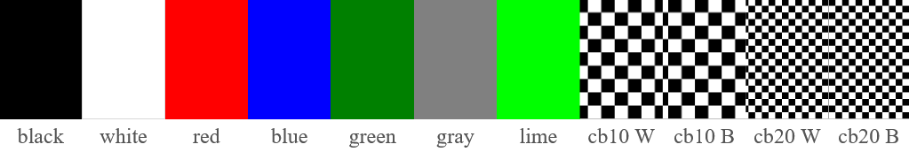

# QuickScreenTest

A simple fullscreen display test tool that cycles through colors and checkerboard patterns to detect monitor imperfections and pixel issues. A must-use tool to check for dead pixels, backlight bleed, and screen uniformity problems.

## Usage

- Launch the program → it starts **fullscreen**
- Press **any key** to switch to the next test pattern
- Press **ESC** to exit

## Test Colors

- Black
- White
- Red
- Blue
- Green
- Gray (RGB 128,128,128) - best for detecting panel imperfections
- Lime

## Checkerboard Patterns

- 10 × 5 checkerboard
- 10 × 5 checkerboard (inverted)
- 20 × 10 checkerboard
- 20 × 10 checkerboard (inverted)

## Useful for detecting

- Dead or stuck pixels
- Backlight bleed
- Brightness uniformity issues
- Dirty screen effect
- Scaling or sharpness problems

